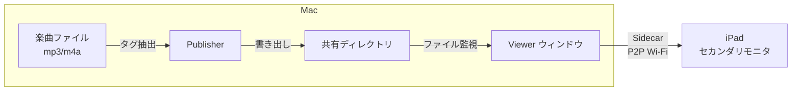

# now-dj-playing

DJプレイ中の楽曲情報（曲名・アーティスト・アルバム・アートワーク）をリアルタイムに表示するアプリケーション。

## 概要

DJプレイ中の楽曲情報をリアルタイムに iPad へ表示するシステム。

現在は Mac 上で publisher（楽曲情報の抽出）と viewer（表示）を動作させ、iPad を Sidecar でセカンダリモニタとして利用する構成で運用している。



将来的には複数 publisher 対応や中継サーバ経由での構成を予定。詳細は [docs/vision.md](docs/vision.md) を参照。

## プロジェクト構成

```
now-dj-playing/
├─ apps/
│   ├─ viewer/          Tauri 2 + React + Vite + Tailwind (macOS 表示アプリ)
│   └─ publisher/       楽曲タグ抽出 CLI ツール (Rust)
├─ packages/
│   ├─ watch-core/      ファイル監視コアロジック (pure Rust)
│   └─ shared/schemas/  JSON スキーマ定義
├─ sandbox/             開発用ダミーデータ
└─ docs/adr/            Architecture Decision Records
```

## セットアップ

### 前提条件

- Node.js (nodenv で管理、バージョンは `.envrc` 参照)
- Rust (rustup)
- Yarn v1
- Xcode (Tauri macOS ビルド時)

### 手順

```sh
# direnv を有効化
direnv allow

# viewer の依存インストール
cd apps/viewer
yarn install

# publisher のビルド
cd apps/publisher
cargo build
```

## 開発

### Viewer (表示アプリ)

```sh
cd apps/viewer

# 開発用設定ファイルを作成
cp src-tauri/config/development.json.example src-tauri/config/development.json
# development.json を環境に合わせて編集

# 開発サーバー起動
cargo tauri dev
```

設定ファイルは `.envrc` の `NDP_CONFIG` 環境変数で指定されたパスから読み込まれる。設定ファイルの探索順序やスキーマについては [ADR-0016](docs/adr/0016-20260704-config-file-lookup.md) を参照。

#### 設定ファイル (`ndp.config.json`)

```jsonc
{
  // 監視対象ディレクトリ（~ はホームディレクトリに展開、相対パスは設定ファイル基準で解決）
  "watch_dir": "~/ndp",
  "dj_id": "dj-000",
  "event_name": "Club Night vol.3",
  "enable_comments": true,
  "show_tags": true,
  // 背景画像設定
  "background_image": {
    "base_dir": "~/apps/ndp/bg",
    "path": "background.png"
  }
}
```

| キー | デフォルト値 | 説明 |
|---|---|---|
| `watch_dir` | `~/ndp` | 監視対象ベースディレクトリ |
| `dj_id` | `"dj-000"` | 対象 DJ ディレクトリ名 |
| `event_name` | *(なし)* | イベント名の表示テキスト |
| `show_event_name` | `true` | イベント名の表示/非表示 |
| `enable_comments` | `false` | コメント表示の初期状態 |
| `show_tags` | `true` | タグ表示の初期状態 |
| `background_image` | *(なし)* | 背景画像設定（オブジェクト） |
| `background_image.base_dir` | - | 背景画像を格納するディレクトリ |
| `background_image.path` | `null` | `base_dir` からの相対パス（`null` で「なし」） |

パス指定は以下の形式に対応:
- 絶対パス: `/tmp/ndp`
- `~` 付きパス: `~/ndp`（ホームディレクトリに展開）
- 相対パス: `./data`（設定ファイルの配置ディレクトリ基準で解決）

viewer は起動時に `watch_dir` を自動作成し、再帰的に監視する。`dj_id` で指定した DJ ディレクトリが後から作成されても検知する（起動順序に依存しない）。

#### キーボードショートカット

| キー | 説明 |
|---|---|
| `b` | 背景画像の選択（一覧オーバーレイを表示） |
| `c` | コメント表示のトグル |
| `t` | タグ表示のトグル |
| `e` | イベント名表示のトグル |
| `m` | モニタウィンドウを開く |
| `?` | ショートカット一覧の表示 |
| `Escape` | オーバーレイを閉じる |

### Publisher (書き出しツール)

```sh
cd apps/publisher

cargo run -- --file /path/to/track.mp3 --out /path/to/shared/ --id dj-000 --dj-name "DJ名"
```

#### オプション

| オプション | 必須 | デフォルト | 説明 |
|---|---|---|---|
| `--file` (`-f`) | ✓ | - | 楽曲ファイルパス (mp3, m4a) |
| `--out` (`-o`) | ✓ | - | 出力先ベースディレクトリ |
| `--id` | - | `dj-000` | DJ ディレクトリ名 |
| `--dj-name` | - | - | DJ 名テキスト or ロゴ画像パス |

コメント情報は楽曲ファイルのタグ（ID3 Comment / M4A Comment）から自動的に抽出される。

### Watch Core (検証)

```sh
cd packages/watch-core

# ローカル監視の動作確認
cargo run --example watch_local -- ../../sandbox
```

## データプロトコル

### ディレクトリ構成

```
{base_dir}/
└─ {dj-id}/
    ├─ dj-profile[.txt|.png|.jpg|.jpeg]  DJ プロファイル
    ├─ now_playing.json                   楽曲情報
    ├─ artwork.{png|jpg|jpeg}             アートワーク (optional)
    └─ .ready                             同期完了マニフェスト
```

### .ready (マニフェスト)

全ファイル書き出し後に最後に作成される。viewer はこのファイルの変更のみを検知する。

```json
{
  "updated_at": "2026-06-28T15:30:00+09:00",
  "files": ["now_playing.json", "artwork.png"]
}
```

### now_playing.json

```json
{
  "title": "曲名",
  "artist": "アーティスト名",
  "album": "アルバム名",
  "artwork": "artwork.png",
  "comment": "コメント情報",
  "updated_at": "2026-06-28T15:30:00+09:00"
}
```

## 技術スタック

- **Viewer**: Tauri 2 (macOS) + React + Vite + Tailwind CSS
- **Publisher**: Rust CLI (id3 + mp4ameta)
- **Watch Core**: Rust (notify クレート)

## ADR

設計判断の記録は `docs/adr/` を参照。
