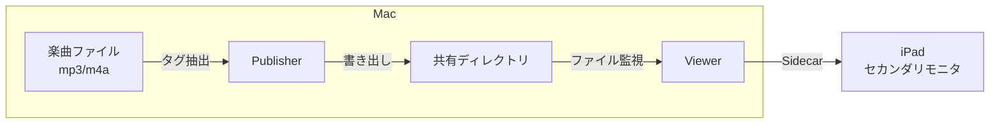
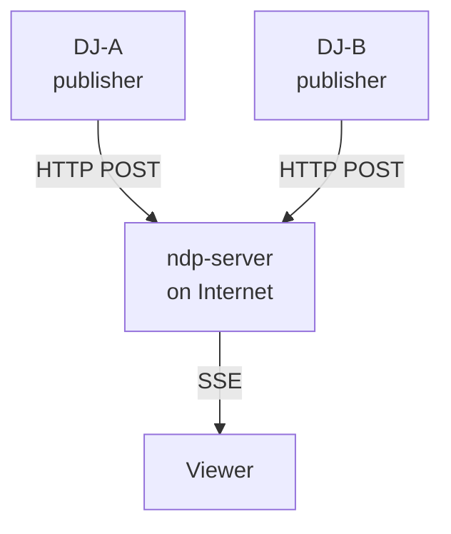

# now-dj-playing

DJプレイ中の楽曲情報（曲名・アーティスト・アルバム・アートワーク）をリアルタイムに表示するシステム。

## 概要

DJ プレイ中の楽曲情報を iPad 等のディスプレイにリアルタイム表示する。2 つの動作モードを持ち、用途に応じて切り替えられる。

### Local モード (Phase 1)

Mac 上で publisher と viewer を動作させ、共有ディレクトリ経由でファイル監視により連携。iPad は Sidecar でセカンダリモニタとして利用する。



### Web モード (Phase 2)

インターネット上の中継サーバ (ndp-server) を介して publisher と viewer を接続。複数の publisher が 1 つのセッションに参加し、DJ リレー形式で運用できる。



- 場所を問わず接続可能
- 複数 publisher 対応（DJ リレー形式）
- viewer にロースター（参加 DJ 一覧）を表示

将来的な Phase 3 (LAN 内中継サーバ) については [docs/vision.md](docs/vision.md) を参照。

## プロジェクト構成

```
now-dj-playing/
├─ apps/
│   ├─ viewer/          Tauri 2 + React + Vite + Tailwind (macOS 表示アプリ)
│   ├─ publisher/       楽曲タグ抽出 CLI ツール (Rust)
│   ├─ publisher-gui/   Publisher GUI アプリ (Tauri 2)
│   └─ server/          中継サーバ (Rust, axum)
├─ deploy/
│   └─ ndp-server/      デプロイスクリプト・設定 (Lightsail + Caddy + systemd)
├─ packages/
│   ├─ watch-core/      ファイル監視コアロジック (pure Rust)
│   └─ shared/schemas/  JSON スキーマ定義
├─ sandbox/             開発用ダミーデータ
└─ docs/adr/            Architecture Decision Records
```

## セットアップ

### 前提条件

- Node.js (nodenv で管理、バージョンは `.envrc` 参照)
- Rust (rustup)
- Yarn v1
- Xcode (Tauri macOS ビルド時)
- direnv

### 手順

```sh
# direnv を有効化
direnv allow

# viewer の依存インストール
cd apps/viewer && yarn install

# publisher-gui の依存インストール
cd apps/publisher-gui && yarn install

# publisher のビルド
cd apps/publisher && cargo build

# server のビルド
cd apps/server && cargo build
```

## アプリケーション

### Viewer (表示アプリ)

Tauri 2 + React の macOS デスクトップアプリ。楽曲情報をリアルタイムに表示する。

```sh
cd apps/viewer
cargo tauri dev
```

#### 設定ファイル

`.envrc` の `NDP_CONFIG` 環境変数で指定されたパスから読み込まれる。形式は JSONC（コメント、trailing comma を許容）。

設定ファイルの探索順序については [ADR-0016](docs/adr/0016-20260704-config-file-lookup.md)、パーサーの詳細は [ADR-0024](docs/adr/0024-20260716-config-parser-migration.md) を参照。

```jsonc
{
  // local モード設定
  "local": {
    "watch_dir": "~/ndp",
    "dj_id": "dj-000"
  },
  // web モード設定
  "web": {
    "endpoint_url": "https://relay.example.com"
  },
  "mode": "local",  // "local" | "web"
  "event_name": "Club Night vol.3",
  "enable_comments": true,
  "show_tags": true,
  "background_image": {
    "base_dir": "~/apps/ndp/bg",
    "path": "background.png"
  }
}
```

| キー | デフォルト値 | 説明 |
|---|---|---|
| `mode` | `"local"` | データソースモード (`local` / `web`) |
| `local.watch_dir` | `"~/ndp"` | 監視対象ベースディレクトリ |
| `local.dj_id` | `"dj-000"` | 対象 DJ ディレクトリ名 |
| `web.endpoint_url` | - | ndp-server の API エンドポイント URL |
| `event_name` | *(なし)* | イベント名の表示テキスト |
| `show_event_name` | `true` | イベント名の表示/非表示 |
| `enable_comments` | `false` | コメント表示の初期状態 |
| `show_tags` | `true` | タグ表示の初期状態 |
| `background_image.base_dir` | - | 背景画像を格納するディレクトリ |
| `background_image.path` | `null` | `base_dir` からの相対パス（`null` で「なし」） |

パス指定は絶対パス、`~` 付きパス（ホームディレクトリ展開）、相対パス（設定ファイル基準で解決）に対応。

#### キーボードショートカット

| キー | 説明 |
|---|---|
| `r` | 設定ファイルの再読み込み |
| `b` | 背景画像の選択（一覧オーバーレイを表示） |
| `c` | コメント表示のトグル |
| `t` | タグ表示のトグル |
| `e` | イベント名表示のトグル |
| `m` | モニタウィンドウを開く |
| `?` | ショートカット一覧の表示 |
| `Escape` | オーバーレイを閉じる |

### Publisher (CLI)

楽曲ファイルからタグ・アートワークを抽出し、共有ディレクトリまたは ndp-server に送信する Rust CLI ツール。

```sh
cd apps/publisher

# local モード
cargo run -- --file /path/to/track.mp3 --out ~/ndp --id dj-000 --dj-name "DJ名"

# web モード
cargo run -- -W --file /path/to/track.mp3 --dj-name "DJ名" -C 037482
```

#### オプション

| オプション | 短縮 | 説明 |
|---|---|---|
| `--version` | `-v` | バージョン情報を表示 |
| `--config-file` | `-c` | 設定ファイルのパスを指定 |
| `--web-mode` | `-W` | web モードで動作 |
| `--code` | `-C` | セッション参加用 6 桁コード (web モード) |
| `--join-only` | `-J` | join のみ実行して終了 (web モード) |
| `--leave` | `-L` | セッションから離脱 (web モード) |
| `--file` | `-f` | 楽曲ファイルパス (mp3, m4a) |
| `--out` | `-o` | 出力先ベースディレクトリ (local モード) |
| `--id` | | DJ ディレクトリ名 (local モード、デフォルト: `dj-000`) |
| `--dj-name` | | DJ 名テキスト |

#### 設定ファイル (`publish.config.json`)

ルックアップ順:
1. `-c` オプションで指定されたパス
2. 環境変数 `NDP_PUBLISH_CONFIG`
3. カレントディレクトリの `ndp-publish.config.json`
4. `$HOME/.config/ndp/publish.config.json`

```jsonc
{
  "dj_name": "DJ名",
  "local": {
    "dj_id": "dj-000",
    "publish_base_dir": "~/ndp"
  },
  "web": {
    "endpoint_url": "https://relay.example.com"
  }
}
```

### Publisher GUI

Tauri 2 デスクトップアプリ。楽曲ファイルをドラッグ&ドロップで publish できる GUI 版 publisher。

```sh
cd apps/publisher-gui
cargo tauri dev
```

- ファイルドロップによる publish
- セッション join / leave
- always-on-top ウィンドウ (320x420)

### Server (ndp-server)

publisher と viewer を中継する REST + SSE サーバ。

```sh
cd apps/server
cargo run
# http://localhost:8080 で起動
```

#### API

| メソッド | パス | 用途 | 認証 |
|---|---|---|---|
| GET | `/health` | ヘルスチェック | なし |
| POST | `/api/sessions/create` | セッション作成 (viewer 用) | なし |
| POST | `/api/sessions/join` | セッション参加 (publisher 用) | なし |
| POST | `/api/sessions/{id}/publish` | 楽曲情報の送信 | Bearer トークン |
| POST | `/api/sessions/{id}/leave` | セッション離脱 | Bearer トークン |
| GET | `/api/sessions/{id}/stream` | SSE ストリーム (viewer 用) | Bearer トークン |

詳細は [apps/server/README.md](apps/server/README.md) を参照。

#### デプロイ

本番環境: AWS Lightsail (Debian 13, $5/月) + Caddy (TLS 自動, Let's Encrypt)。

- エンドポイント: `https://ndp.iss.ms`
- ビルド: `cargo-zigbuild` + `x86_64-unknown-linux-musl` で静的リンクバイナリを生成
- 配置: scp + systemd で管理
- 詳細: [deploy/ndp-server/README.md](deploy/ndp-server/README.md)

### Watch Core

ファイル監視のコアロジック (pure Rust ライブラリクレート)。viewer の local モードで使用。

```sh
cd packages/watch-core
cargo run --example watch_local -- ../../sandbox
```

## データプロトコル (Local モード)

### ディレクトリ構成

```
{base_dir}/
└─ {dj-id}/
    ├─ dj-profile[.txt|.png|.jpg|.jpeg]  DJ プロファイル
    ├─ now_playing.json                   楽曲情報
    ├─ artwork.{png|jpg|jpeg}             アートワーク (optional)
    └─ .ready                             同期完了マニフェスト
```

### .ready (マニフェスト)

全ファイル書き出し後に最後に作成される。viewer はこのファイルの変更のみを検知する。

```json
{
  "updated_at": "2026-06-28T15:30:00+09:00",
  "files": ["now_playing.json", "artwork.png"]
}
```

### now_playing.json

```json
{
  "title": "曲名",
  "artist": "アーティスト名",
  "album": "アルバム名",
  "artwork": "artwork.png",
  "comment": "コメント情報",
  "updated_at": "2026-06-28T15:30:00+09:00"
}
```

## 技術スタック

| コンポーネント | 技術 |
|---|---|
| Viewer | Tauri 2 (macOS) + React + Vite + Tailwind CSS |
| Publisher CLI | Rust (id3 + mp4ameta) |
| Publisher GUI | Tauri 2 (macOS) + React + Vite |
| Server | Rust (axum + tokio) |
| Watch Core | Rust (notify クレート) |

## ADR

設計判断の記録は `docs/adr/` を参照。
