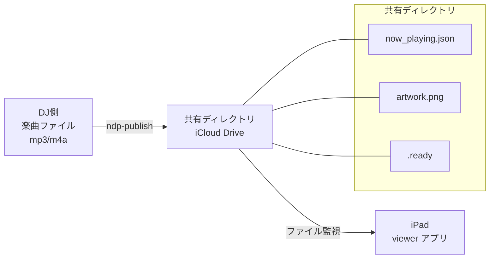

# Now DJ Playing

DJプレイ中の楽曲情報（曲名・アーティスト・アルバム・アートワーク）をリアルタイムに表示するアプリケーション。

## 概要

DJ側から共有ディレクトリ（iCloud Drive 等）経由でファイルとして楽曲情報がプッシュされ、iPad 上の viewer アプリがそれを監視・解析・表示する。



## プロジェクト構成

```
now-dj-playing/
├─ apps/
│   ├─ viewer/          Tauri 2 + React + Vite + Tailwind (iPad 表示アプリ)
│   └─ publisher/       楽曲タグ抽出 CLI ツール (Rust)
├─ packages/
│   ├─ watch-core/      ファイル監視コアロジック (pure Rust)
│   └─ shared/schemas/  JSON スキーマ定義
├─ sandbox/             開発用ダミーデータ
└─ docs/adr/            Architecture Decision Records
```

## セットアップ

### 前提条件

- Node.js (nodenv で管理、バージョンは `.envrc` 参照)
- Rust (rustup)
- Yarn v1
- Xcode (iOS ビルド時)

### 手順

```sh
# direnv を有効化
direnv allow

# viewer の依存インストール
cd apps/viewer
yarn install

# publisher のビルド
cd apps/publisher
cargo build
```

## 開発

### Viewer (表示アプリ)

```sh
cd apps/viewer

# .env.development を作成 (.env.example を参照)
cp .env.example .env.development
# VITE_WATCH_DIR と VITE_DEFAULT_DJ_ID を設定

# 開発サーバー起動
cargo tauri dev
```

### Publisher (書き出しツール)

```sh
cd apps/publisher

cargo run -- --file /path/to/track.mp3 --out /path/to/shared/ --id dj-000 --dj-name "DJ名"
```

#### オプション

| オプション | 必須 | デフォルト | 説明 |
|---|---|---|---|
| `--file` | ✓ | - | 楽曲ファイルパス (mp3, m4a) |
| `--out` | ✓ | - | 出力先ベースディレクトリ |
| `--id` | - | `dj-000` | DJ ディレクトリ名 |
| `--dj-name` | - | - | DJ 名テキスト or ロゴ画像パス |

### Watch Core (検証)

```sh
cd packages/watch-core

# ローカル監視の動作確認
cargo run --example watch_local -- ../../sandbox
```

## データプロトコル

### ディレクトリ構成

```
{base_dir}/
└─ {dj-id}/
    ├─ dj-profile[.txt|.png|.jpg|.jpeg]  DJ プロファイル
    ├─ now_playing.json                   楽曲情報
    ├─ artwork.{png|jpg|jpeg}             アートワーク (optional)
    └─ .ready                             同期完了マニフェスト
```

### .ready (マニフェスト)

全ファイル書き出し後に最後に作成される。viewer はこのファイルの変更のみを検知する。

```json
{
  "updated_at": "2026-06-28T15:30:00+09:00",
  "files": ["now_playing.json", "artwork.png"]
}
```

### now_playing.json

```json
{
  "title": "曲名",
  "artist": "アーティスト名",
  "album": "アルバム名",
  "artwork": "artwork.png",
  "updated_at": "2026-06-28T15:30:00+09:00"
}
```

## 技術スタック

- **Viewer**: Tauri 2 (iOS) + React + Vite + Tailwind CSS
- **Publisher**: Rust CLI (id3 + mp4ameta)
- **Watch Core**: Rust (notify クレート)
- **共有方式**: iCloud Drive (将来的に Dropbox 等へ拡張可能)

## ADR

設計判断の記録は `docs/adr/` を参照。
