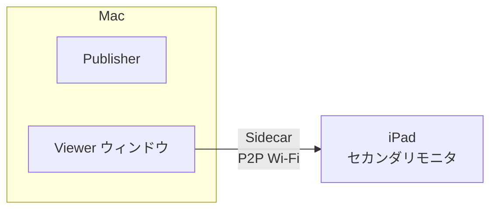
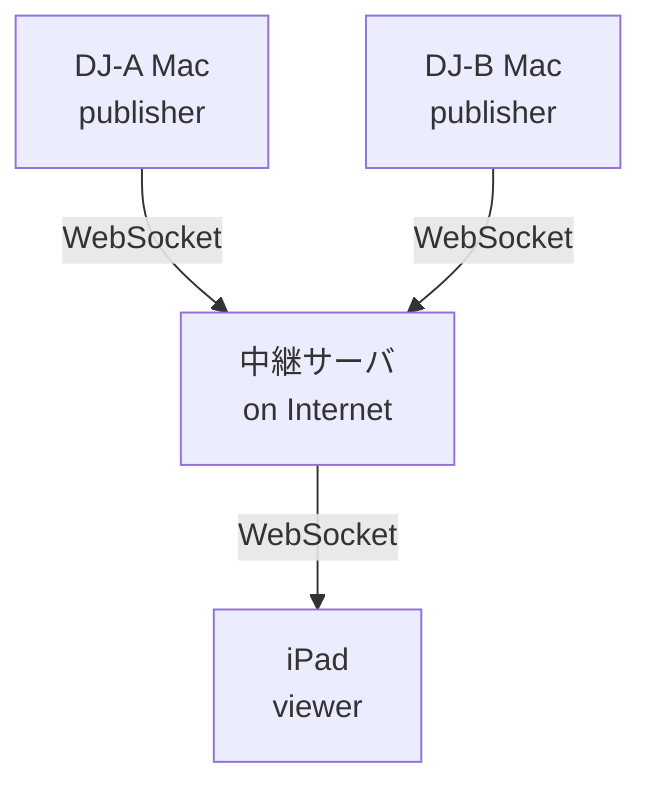
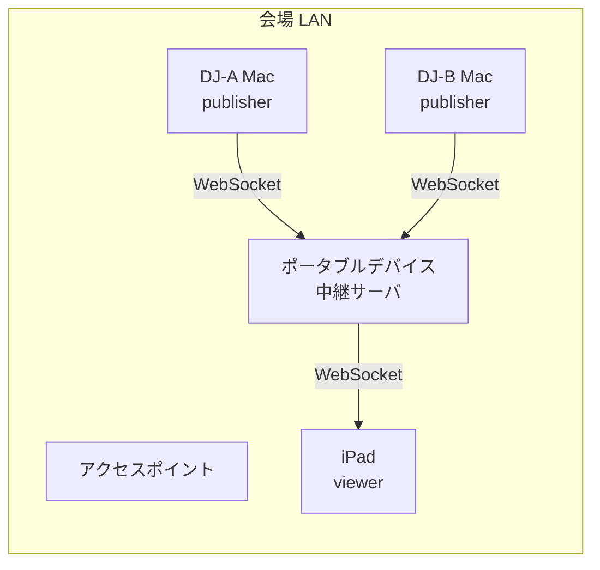
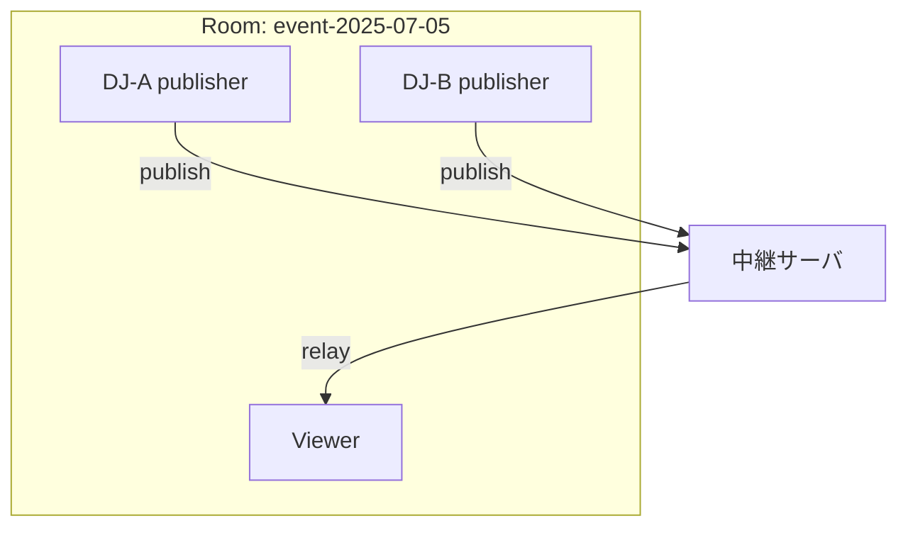

# ビジョン: now-dj-playing の展開構想

## プロジェクトの目的

DJプレイ中の楽曲情報（曲名・アーティスト・アルバム・アートワーク）をリアルタイムに表示する。
最終的には、複数の DJ（publisher）がリレー形式で交代しながら、1台の viewer に情報を集約して表示する構成を目指す。

## 方針

- **iOS ネイティブアプリの開発は行わない。** Phase 1 では Sidecar（画面ミラーリング）、Phase 2 以降では iPad のブラウザ（Safari）上で動作する Web アプリとして viewer を提供する。

## フェーズ計画

### Phase 1: Sidecar 方式（現行）

Mac 上で publisher と viewer を動作させ、iPad を Sidecar（画面ミラーリング）でセカンダリモニタとして利用する。



- **前提**: Mac + iPad のみ（追加機材不要）
- **通信**: P2P Wi-Fi（AirPlay / Sidecar）。アクセスポイント不要
- **制約**: publisher 1台、viewer 1台。Mac と iPad が近くにある必要あり
- **現状**: テスト運用済み

---

### Phase 2: クラウド中継サーバ

インターネット上に中継サーバを配置。publisher と viewer が物理的に離れていても動作する。物理デバイスの確保が不要なため、ソフトウェアの実装だけで実現できる。



- **前提**: 各デバイスがインターネットに接続可能
- **通信**: WebSocket over Internet
- **特徴**:
  - 場所を問わず接続可能
  - 複数 publisher 対応（DJ リレー形式）
  - 配信イベントやリモート参加への対応
  - 物理デバイスの調達不要、すぐに始められる
  - デプロイ先候補: AWS (Lightsail, ECS, Lambda 等) / Fly.io / Railway / VPS 等
  - コスト感: 月$0〜5 程度。データ量が極めて小さい（JSON 数百バイト × 曲変更のたび）ため、どのサービスでもほぼ最小課金単位に収まる見込み

---

### Phase 3: LAN 内中継サーバ（ポータブルデバイス）

Raspberry Pi やミニPC 等の小型デバイスを中継サーバとして会場 LAN に設置。複数 publisher から viewer へ WebSocket で中継する。インターネット接続に依存しない自己完結型の構成。



- **前提**: 会場にアクセスポイントがあること
- **通信**: Wi-Fi LAN 内 WebSocket
- **デバイス候補**: Raspberry Pi、ミニPC、NUC 等 — 機材バッグに収まるサイズであれば何でもよい
- **viewer のバリエーション**:
  - iPad のブラウザ（Safari）で Web 版 viewer にアクセス
  - ポータブルデバイスに直接モニタを接続して viewer を表示
  - ブラウザ版 viewer であれば、モニタ付きの任意のデバイスから接続可能
- **特徴**:
  - 複数 publisher 対応（DJ リレー形式）
  - インターネット不要、会場内完結
  - 小型・低コスト・持ち運び可能
  - Rust バイナリのクロスコンパイルで ARM / x86 どちらにも対応
- **補足**: デバイス自体を AP 化（`hostapd` 等）すれば、会場 AP すら不要にできる

---

## 中継サーバの設計方針

### ルームモデル



- 1つのルームに複数の publisher + 単一の viewer
- publisher は交互にメッセージを送信（DJ リレー）
- viewer は最新の now_playing をそのまま表示
- ルームを複数持てる設計にすれば、同一サーバで複数イベントを同時に扱える

### エンドポイント（案）

```
/ws/room/{room_id}/publish   ← publisher が接続
/ws/room/{room_id}/view      ← viewer が接続
```

### サーバの振る舞い

- publish 側からメッセージを受けたら、同ルームの view 側に転送
- ルームごとに最後の now_playing を保持（viewer 途中接続時に即送信）
- データ量は小さい（JSON 数百バイト × 曲変更のたび）ため、最小スペックで十分

### 技術スタック

- Rust（`axum` + `tokio-tungstenite`）
- publisher と同じ言語で統一し、クロスコンパイルで Pi にもデプロイ可能

---

## 展開パターン早見表

| 環境 | 構成 | インフラ | 複数 publisher |
|---|---|---|---|
| 手元テスト | Sidecar | なし（P2P Wi-Fi） | × |
| リモート / 配信 | クラウド中継 | AWS / Fly.io 等 | ○ |
| 会場（LAN あり） | ポータブル中継 | Pi / ミニPC 等 | ○ |
| 会場（LAN なし） | デバイス AP 化 + 中継 | Pi / ミニPC 等 | ○ |

---

## 将来的な拡張の可能性

- viewer の複数台対応（ブロードキャスト）
- DJ プロファイルの切り替え演出
- セットリスト履歴の記録・表示
